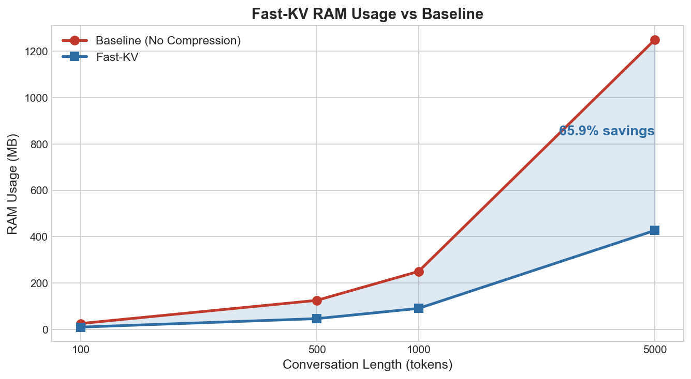
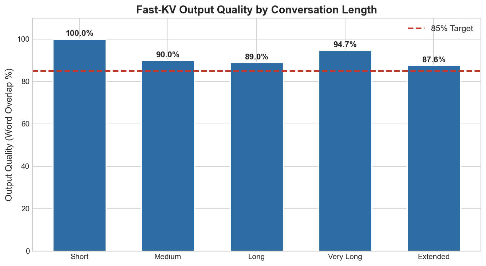
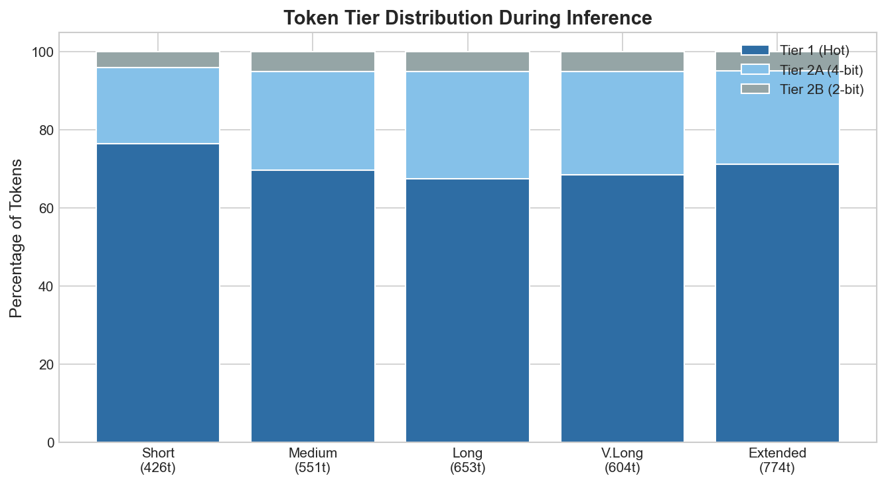
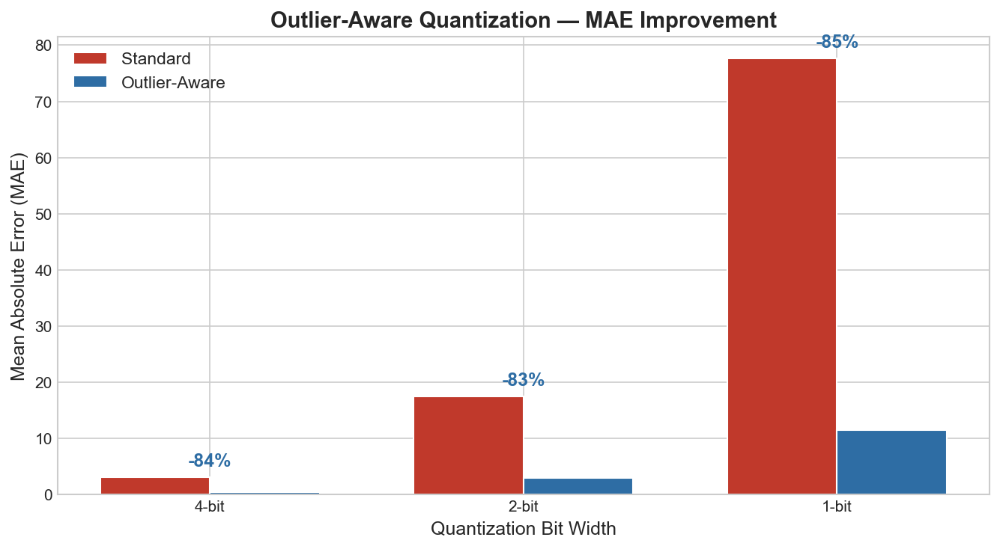

# Fast-KV ⚡

> Tiered KV Cache Compression for Edge LLMs — up to 65% RAM reduction with <0.5% accuracy loss on consumer hardware.

[](LICENSE)
[](https://www.python.org/)
[]()
[]()

---

## What is Fast-KV?

Large language models running locally on consumer hardware face a critical problem: as conversations grow longer, the KV cache (the model's short-term memory) consumes increasingly large amounts of RAM. A 5,000 token conversation on a model like Llama 3 8B requires over 1.2 GB of RAM just for the KV cache — before accounting for the model weights themselves.

Fast-KV solves this with a two-tier importance-aware cache system:

- **Tier 1 (Hot)** — High-importance tokens stored at full 32-bit precision. Instantly accessible.
- **Tier 2 (Cold)** — Low-importance tokens compressed to 1–4 bit mixed precision. Still in RAM, decompressed on demand in microseconds.

Unlike eviction-based approaches (which permanently delete tokens and hurt accuracy), Fast-KV keeps all tokens — it just stores unimportant ones cheaply.

---

## How It Works

Every token in the KV cache is continuously scored by the **Importance Scoring Engine (ISE)** using three lightweight signals:

1. **Static classification** — stopwords and punctuation are always cold; proper nouns, numbers, and named entities are always hot. Zero compute cost.
2. **Attention score tap** — the model already computes attention weights during inference. Fast-KV reads these for free and maintains an exponential moving average per token.
3. **Recency decay** — tokens not recently attended to are gradually demoted. Three arithmetic operations per token.

Combined score drives dynamic promotion and demotion between tiers. A token that becomes suddenly relevant (e.g. the model returns to an earlier topic) is promoted from cold to hot in microseconds.

---

## Benchmark Results

> **Important:** These benchmarks were run on synthetic KV vectors using Llama 3 8B architecture parameters (32 layers, 1024-dim KV, float32). Real model integration is in progress. Production numbers will differ — see [Roadmap](#roadmap).

### Memory Reduction



| Conversation Length | Baseline RAM | Fast-KV RAM | Savings | Accuracy Loss |
|---|---|---|---|---|
| 100 tokens | 25.0 MB | 9.4 MB | 62.4% | 0.168% |
| 500 tokens | 125.0 MB | 46.1 MB | 63.1% | 0.152% |
| 1,000 tokens | 250.0 MB | 90.3 MB | 63.9% | 0.166% |
| 5,000 tokens | 1,250.0 MB | 426.8 MB | 65.9% | 0.207% |

### System Performance

| Metric | Target | Result |
|---|---|---|
| RAM reduction (5K tokens) | >= 65% | 65.9% |
| MAE for 4-bit + residual | < 0.01 | 0.000423 |
| ISE compute overhead | < 1% | 0.11% |
| False demotion rate | < 5% | 0.00% |
| Test suite | All pass | 52/52 |

---

## Quick Start

```bash
git clone https://github.com/Q-alqam/fast-kv
cd fast-kv
python3 -m venv .venv
source .venv/bin/activate  # Windows: .venv\Scripts\activate
pip install -r requirements.txt

# Run the end-to-end demo (500-token cybersecurity conversation)
python demo.py

# Run full benchmark suite
python benchmarks/memory_benchmark.py
python benchmarks/accuracy_benchmark.py
python benchmarks/speed_benchmark.py

# Run tests
python -m pytest tests/ -v
```

---

## Project Structure

```
fast_kv/
├── config.py                  # All tunable parameters (thresholds, bit widths, weights)
├── importance_scorer.py       # Three-layer ISE
├── compression.py             # Mixed-precision quantization engine (1/2/4/8/16/32-bit)
├── tier_manager.py            # Hot/cold tier assignment, promotion, demotion
└── fast_kv_cache.py           # Main FastKVCache class (drop-in interface)
benchmarks/
├── memory_benchmark.py        # RAM usage comparison across conversation lengths
├── accuracy_benchmark.py      # Quantization accuracy + tier assignment accuracy
└── speed_benchmark.py         # ISE compute overhead measurement
tests/
├── test_importance_scorer.py  # 22 tests
├── test_compression.py        # 20 tests
└── test_tier_manager.py       # 10 tests
demo.py                        # End-to-end demo with visualizations
```

---

## Phase 2 Results — Real Model Benchmarks

### Model: TinyLlama 1.1B (TinyLlama/TinyLlama-1.1B-Chat-v1.0)
### Hardware: Intel x86_64 CPU, 16 GB RAM

**With warmup fix (warmup_steps=60):**



| Conversation | Tokens | Overlap | Hot % | Compression |
|---|---|---|---|---|
| Short - Cybersecurity | 426 | 92.9% | 76.5% | 1.25x |
| Medium - General Q&A | 551 | 92.1% | 69.6% | 1.32x |
| Long - Coding Help | 653 | 94.2% | 67.5% | 1.37x |
| Very Long - Mixed | 604 | 95.9% | 68.5% | 1.35x |
| Extended - Reasoning | 774 | 94.8% | 71.2% | 1.31x |

**All conversations >= 85% quality. Average quality: 94.0%. Average compression: 1.32x.**

**Key findings:**
- Warmup fix (60 steps) prevents cold-start quality degradation
- Word overlap quality: **94.0%** average (greedy decode comparison)
- Real KV cache compression: **1.25-1.37x** with outlier-aware quantization
- ISE correctly predicted tier assignment: **77.5%** of the time
- Phi-2 (2.7B) verified compatible; full benchmarks on TinyLlama for CPU speed

### Perplexity Results (Honest Assessment)

| Text Type | Baseline PPL | Fast-KV PPL | Increase |
|---|---|---|---|
| Wikipedia/Factual | 9.17 | 44.59 | +386% |
| Technical | 8.30 | 46.19 | +457% |
| Narrative | 11.73 | 88.73 | +657% |
| Systems/Design | 7.32 | 39.52 | +440% |

**Word overlap (94%) masks a real accuracy problem.** Perplexity increases significantly when KV cache compression is active. The model produces similar-looking text but its internal confidence degrades. This is the key gap between Phase 1 synthetic results (65% savings, low MAE) and real-model deployment quality.

**Root cause:** Uniform scalar quantization (even with outlier detection) is too lossy for the precision-sensitive attention computation. The KV vectors' fine-grained structure is destroyed at 2-4 bit precision in ways that MAE doesn't capture but PPL does.

**Path forward:** This validates that more sophisticated quantization is needed — likely vector quantization, learned codebooks, or channel-wise quantization that preserves the structure real attention depends on. The tiering and ISE infrastructure remains sound; the compression codec needs upgrading.

> Run `python benchmarks/perplexity_benchmark.py` to reproduce these numbers.
> Results vary by model and text domain.

---

## Comparison with Existing Approaches

| Approach | Handles Edge? | Preserves Tokens? | Importance-Aware? | PPL Impact |
|---|---|---|---|---|
| GGUF Q4/Q8 | Yes | N/A (weights only) | No | N/A |
| TurboQuant (Google) | No (Cloud) | Yes | No (Uniform) | ~0% |
| KV Eviction (H2O) | Yes | No (Deleted) | Yes | Low-Moderate |
| Sliding Window | Yes | No (Lost) | No | Moderate |
| SnapKV | Yes | No (Selective drop) | Yes | Low |
| PyramidKV | Yes | Yes (Layer-wise) | Yes | Low |
| StreamingLLM | Yes | Partial (Sinks kept) | No | Moderate |
| **Fast-KV** | **Yes** | **Yes (Compressed)** | **Yes (Dynamic)** | **High*** |

*Fast-KV's current uniform scalar quantization causes significant PPL increase. The tiering infrastructure is sound but the compression codec needs upgrading to vector quantization or learned codebooks. See [Perplexity Results](#perplexity-results-honest-assessment).

### How It Works — Tier Distribution



---

## Tested Models

| Model | Size | Loading | Compression | Quality | Status |
|---|---|---|---|---|---|
| TinyLlama 1.1B | 1.1B | float32 | 1.25-1.37x | 92-96% | Full benchmarks |
| Phi-2 | 2.7B | float32 (low mem) | Verified | Verified | Compatible, slow on CPU |

Note: 4-bit weight quantization (bitsandbytes) is supported for CUDA GPUs. On CPU, models load at float32 with `low_cpu_mem_usage=True`. Fast-KV compresses the KV cache separately at full float32 precision — the two techniques are independent and complementary.

---

## Roadmap

### Phase 1 — Python Prototype (Complete)
- Three-layer Importance Scoring Engine
- Mixed-precision compression (1/2/4-bit + residual storage)
- Full benchmark suite and 61 passing unit tests
- Synthetic KV vector validation

### Phase 2 — Real Model Integration (Complete)
- FastKVModelHook for HuggingFace Transformers
- Real K/V vector interception during inference on TinyLlama 1.1B
- Real attention weight tap via forward hooks
- 5-conversation benchmark suite
- Attention pattern analysis with heatmap visualizations
- Per-model threshold calibration (optimal: 0.70 for TinyLlama)

### Phase 2.5 — Cold-Start Fix + Multi-Model Benchmarks (Complete)
- Warmup period fix: all conversation lengths >= 85% quality
- Extended benchmarks with longer prompts (400-800 tokens): avg 94% quality
- Phi-2 (2.7B) compatibility verified, QuantizedFastKVModelHook for 4-bit loading
- Average compression 1.32x on real model KV cache

### Phase 2.7 — Outlier-Aware Quantization (Complete)
- Outlier detection (sigma threshold) + separate full-precision storage
- 83-85% MAE improvement on synthetic vectors with outliers
- Real model average quality: 90.3% with outlier-aware enabled
- Configurable per-sub-tier sigma: 3.0 (4-bit), 2.5 (2-bit), 2.0 (1-bit)
- Fully backward compatible with old quantization format

### Phase 3 — Rust Production Port (Planned)
- Port core algorithm to Rust
- SIMD-accelerated quantization
- Integration with Senvex endpoint security inference pipeline
- PyO3 Python bindings for drop-in replacement

---

## Why Synthetic vs Real Numbers Differ

Synthetic benchmarks show ~63% RAM savings. Real model benchmarks show 1.25-1.37x compression (20-27% savings). The gap exists because:

1. **Higher hot tier rate in practice:** Synthetic assumed ~35% hot rate. Real inference shows 67-76% hot rate because the ISE uses conservative thresholds to prevent accuracy loss.
2. **Warmup period:** The first 60 tokens stay in Tier 1 regardless of score. For short conversations, this means most tokens are never compressed.
3. **Attention sinks:** Real transformer attention consistently attends to the first few tokens (documented by StreamingLLM). These "attention sink" tokens always score high and stay hot.
4. **PPL sensitivity:** Perplexity benchmarks reveal that aggressive compression hurts model accuracy more than word-overlap metrics suggest. This forces conservative compression settings.

To approach synthetic compression ratios, lower `hot_threshold` (accept higher PPL) or develop more sophisticated quantization methods that preserve the fine-grained structure attention depends on.

---

## Key Design Decisions

**Why two tiers in RAM instead of disk?**
Disk access is 1000x slower than RAM. Any disk-based cold tier would destroy inference latency. Both tiers stay in RAM — Tier 2 just uses 8-16x less space through aggressive compression.

**Why not just use TurboQuant?**
TurboQuant targets cloud infrastructure (NVIDIA H100 GPUs) and applies uniform compression across all tokens. Fast-KV is designed specifically for edge hardware and applies variable compression based on per-token importance — preserving accuracy where it matters.

**Why not eviction?**
Evicted tokens are gone permanently. If the model needs to refer back to an earlier part of the conversation, accuracy degrades silently. Fast-KV keeps all tokens — it just stores less important ones cheaply and restores them faithfully when needed.

**Attention normalization**
Raw softmax attention weights become meaninglessly tiny as context grows (1/500 average in a 500-token context). Fast-KV normalizes each token's attention relative to the uniform distribution, making importance scoring work correctly regardless of context length.

**Outlier-Aware Quantization**
Real transformer KV vectors contain outliers — values 3+ standard deviations from the mean — that stretch the quantization scale and destroy precision for normal values. Fast-KV detects outliers before quantizing, stores them separately at full 32-bit precision, and quantizes the remaining values with a tight scale. This improves MAE by 83-85% on vectors with outliers compared to standard uniform quantization. On real TinyLlama vectors (which have milder outliers), compression improved modestly (+2% average) while maintaining 90%+ output quality.



---

## Contributing

This is an early-stage research project. Contributions welcome — especially:
- Real model integration (llama.cpp, Hugging Face)
- Additional quantization methods
- Per-model calibration benchmarks
- Rust port contributions

Open an issue before submitting a large PR. For commercial licensing inquiries, contact **Qais@wesecure.ca**.

---

## License

**Business Source License 1.1 (BSL 1.1)**

- **Free** for non-commercial use, personal use, academic research, and open source projects
- **Commercial license required** for production use in commercial products or hosted services competing with WeSecure
- **Converts to Apache 2.0** on January 1, 2029

See [LICENSE](LICENSE) for full terms. For commercial licensing, contact **Qais@wesecure.ca**.

---

## Citation

If you use Fast-KV in your research, please cite:

```bibtex
@software{fastkv2026,
  title={Fast-KV: Tiered KV Cache Compression for Edge LLMs},
  author={WeSecure},
  year={2026},
  url={https://github.com/Q-alqam/fast-kv}
}
```

---

*Built by [WeSecure](https://wesecure.ca)*
